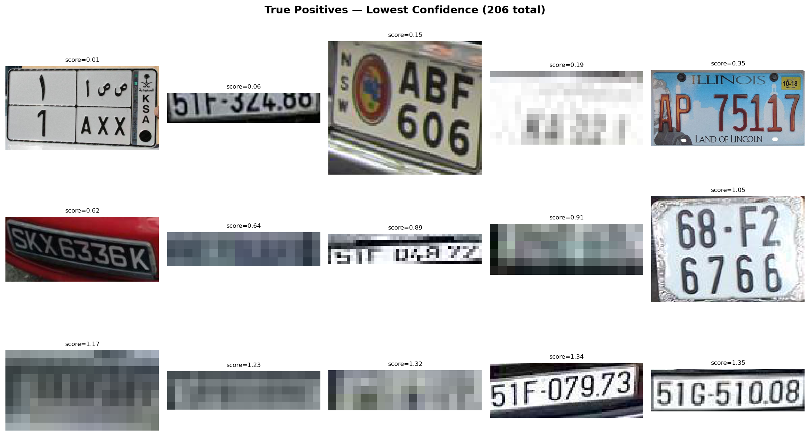
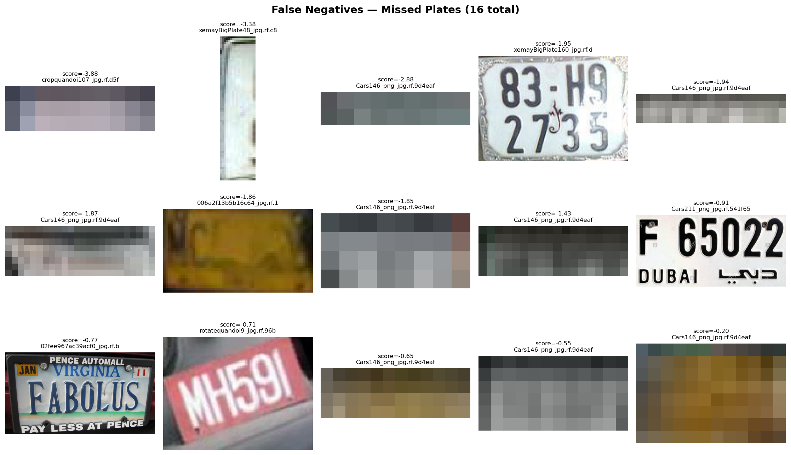
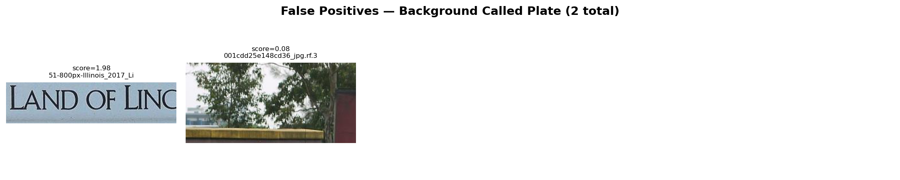

# Qualitative Analysis Report

> Dataset: `../../data/raw/test/images`
> Model: `../classical/models/svm_plate.joblib`
> Images analyzed: 200

## Summary

| Metric | Value |
| --- | --- |
| Total crops | 620 |
| Positive crops (plates) | 222 |
| Negative crops (background) | 398 |
| True Positives | 206 |
| False Negatives | 16 |
| False Positives | 2 |
| True Negatives | 396 |
| Precision | 0.9904 |
| Recall | 0.9279 |
| F1 | 0.9581 |

## Visualizations

### True Positives (lowest confidence)
These are plates the model correctly identified, but with the lowest scores.
They show the boundary of what the model considers a plate.

### False Negatives (missed plates)
These are actual plates that the model classified as background.
Look for patterns: small plates, blur, occlusion, unusual angles.

Interestingly enough, you can see, the model rejected multiple of the plates,
like `cropquandoi107__jpg.rf.d5f` which sits under the labels folder.
Some of the pictures shown in the `False Negative` category are plates that should've been caught: like `xemayBigPlate160__jpg.rf.d`
and some plates like `cropquandoi107__jpg.rf.d5f` are too degraded or blurry to be recognized by the model.

This suggests that the model may struggle with certain angles or perspectives of plates, leading to missed detections.

### False Positives (background called plate)
These are background patches the model mistakenly called plates.
Look for patterns: rectangular shapes, text-like textures, high contrast edges.

