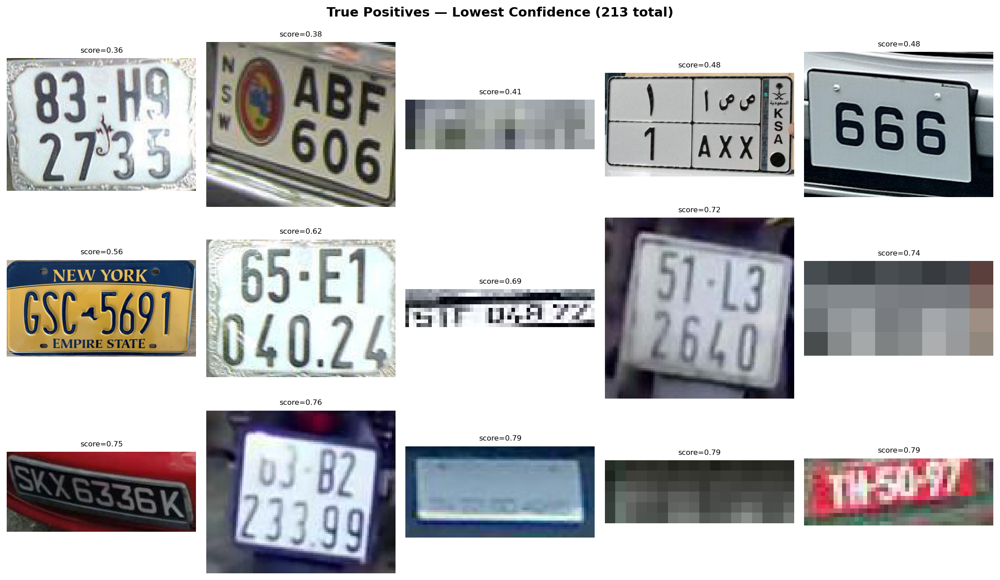
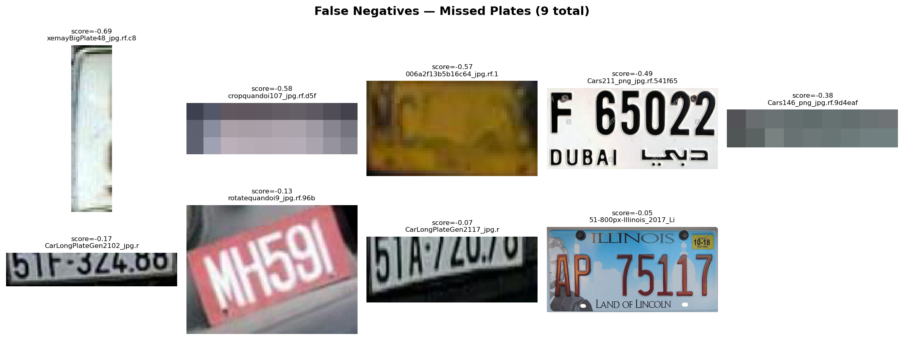
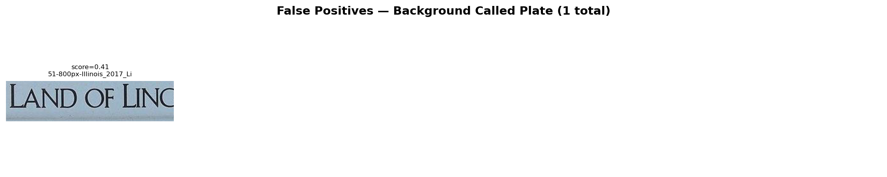

# Qualitative Analysis Report

> Dataset: `../../data/raw/test/images`
> Model: `../../models/svm_plate_rbf.joblib`
> Images analyzed: 200

## Summary

| Metric | Value |
| --- | --- |
| Total crops | 620 |
| Positive crops (plates) | 222 |
| Negative crops (background) | 398 |
| True Positives | 213 |
| False Negatives | 9 |
| False Positives | 1 |
| True Negatives | 397 |
| Precision | 0.9953 |
| Recall | 0.9595 |
| F1 | 0.9771 |

## Visualizations

### True Positives (lowest confidence)
These are plates the model correctly identified, but with the lowest scores.
They show the boundary of what the model considers a plate.

### False Negatives (missed plates)
These are actual plates that the model classified as background.
Look for patterns: small plates, blur, occlusion, unusual angles.

### False Positives (background called plate)
These are background patches the model mistakenly called plates.
Look for patterns: rectangular shapes, text-like textures, high contrast edges.

