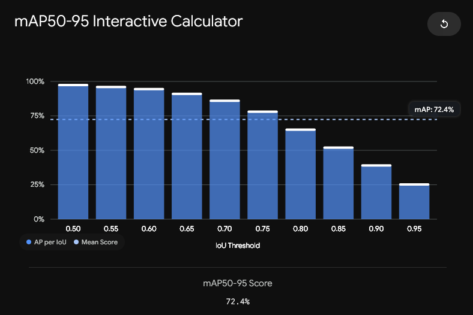
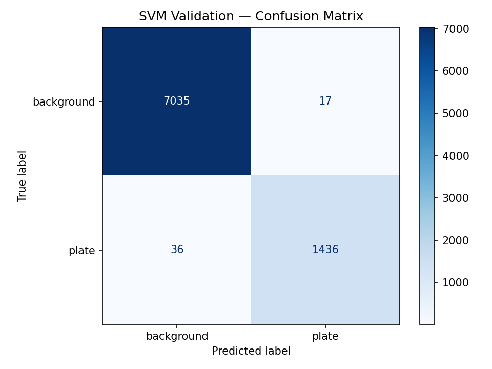
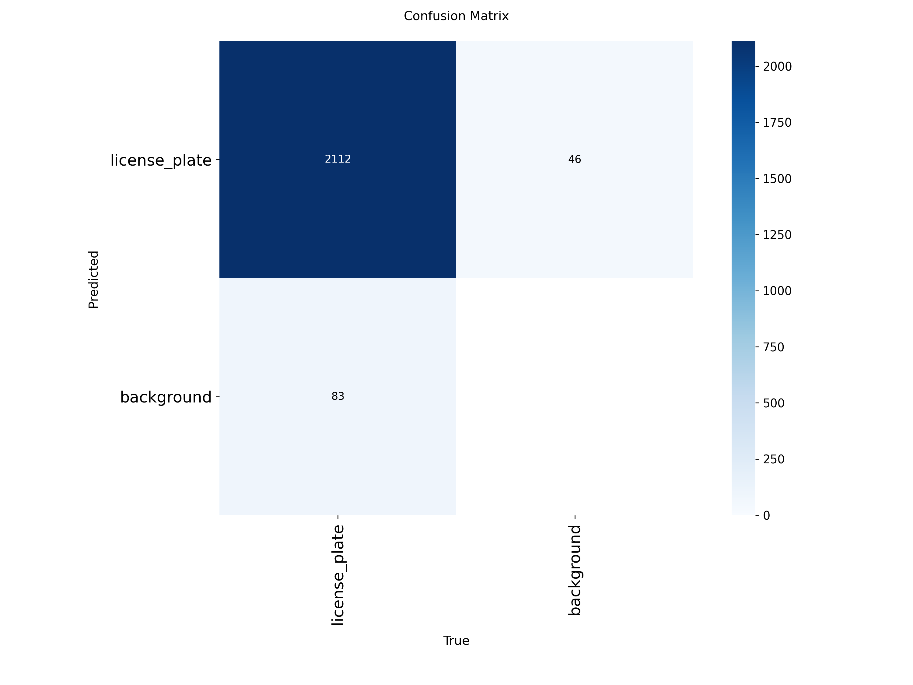
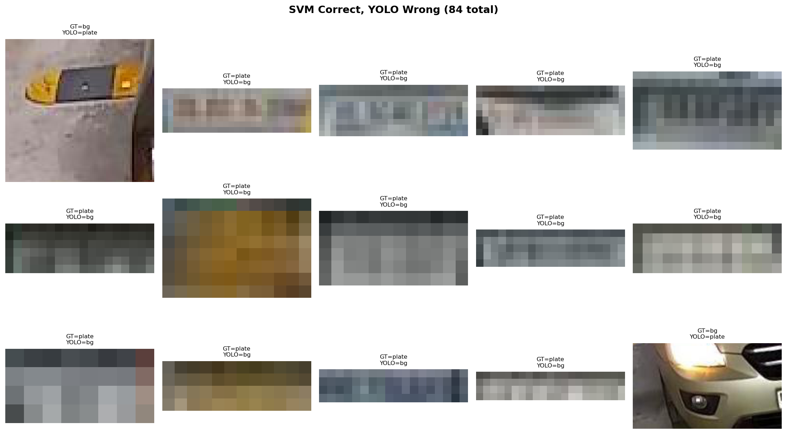
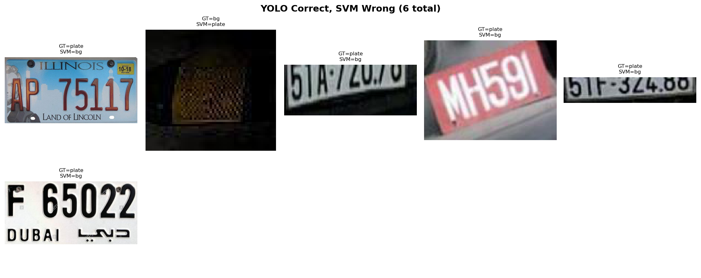
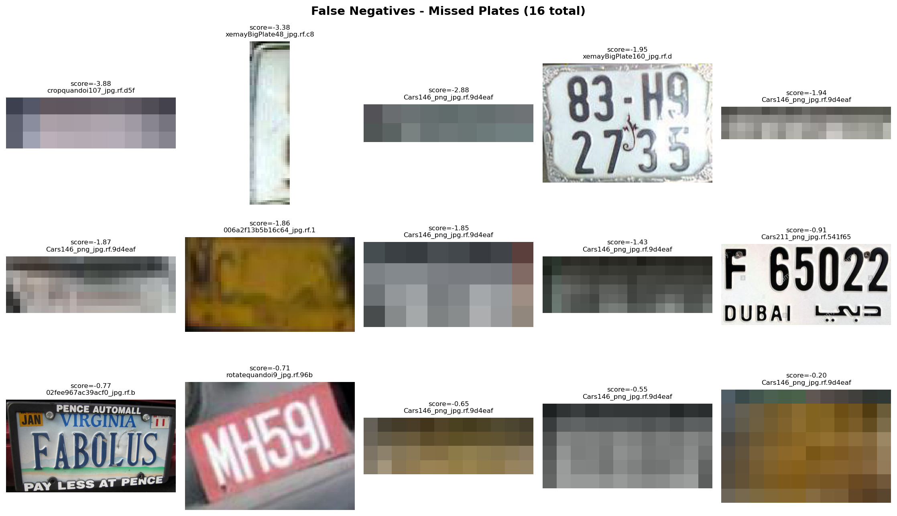
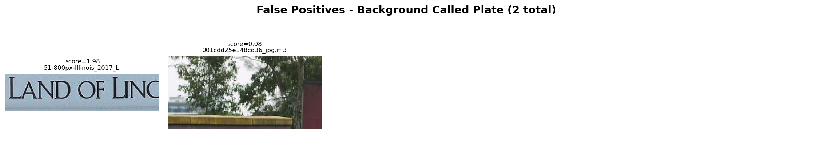
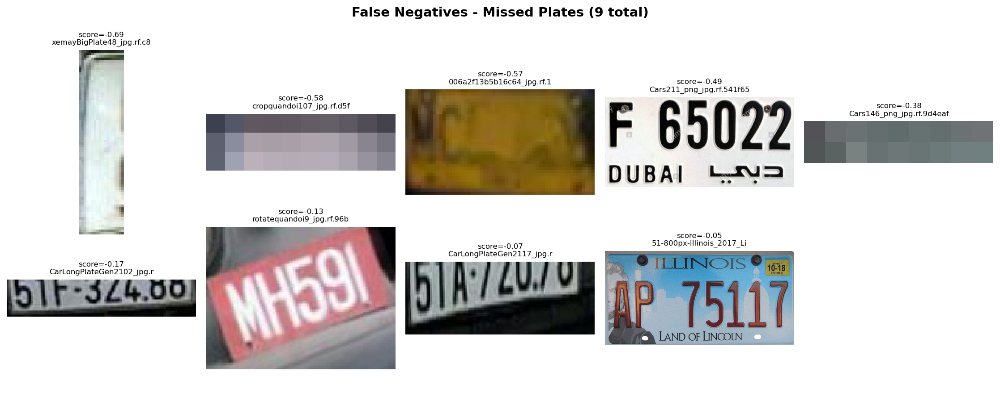
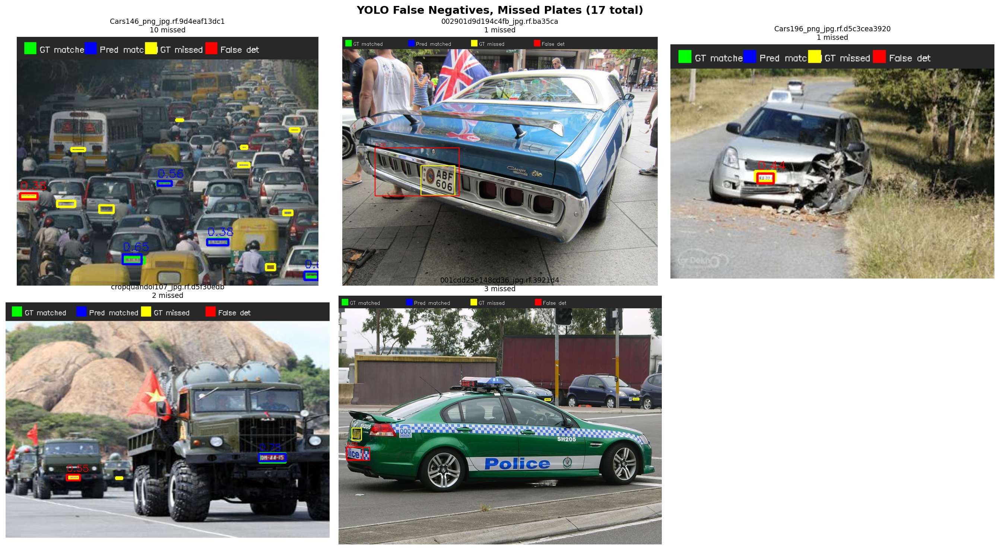

# A Comparative Study of Classical and Deep Learning Approaches for License Plate Detection

> Classical (HOG + SVM) vs Deep Learning (YOLOv8n) for License Plate Detection

---

## Introduction

**Authors:** Ishay Cohen, Mikhael Pelagein

**Dataset:** [License Plate Detection Dataset](https://www.kaggle.com/datasets/barkataliarbab/license-plate-detection-dataset-10125-images) - 10,125 annotated images from Kaggle

**Task:** License plate localization - given an image, find where the plate is. No OCR, no character reading - detection only.

**Research question:** How far can a classical computer vision pipeline go compared to modern deep learning, and under what conditions does each approach succeed or fail?

**Approach:** We implemented and compared two detection pipelines on the same dataset:
- **Classical** - HOG feature extraction + SVM classification + sliding window detection
- **Deep Learning** - YOLOv8n fine-tuned end-to-end

**Repository:** [GitHub](https://github.com/<your-repo>/classical-vs-deep-learning-plate-detection)

**AI Disclosure:** Claude (Anthropic) was used for code assistance: debugging, and Manim visualizations. All architectural decisions, analysis, and conclusions are our own.

**About this project:** This project compares two fundamentally different approaches to the same problem. The classical pipeline breaks detection into manual stages: extract gradient features with HOG, classify patches with SVM, scan the image with a sliding window, and merge overlapping detections with NMS.
Each stage is designed by hand and tuned independently. The deep learning pipeline replaces all of this with a single neural network that learns feature extraction, localization, and classification jointly from data.
**We trained both pipelines on the same dataset**, evaluated them on the same test images, and ran two apples-to-apples comparisons: one at the crop level (where SVM operates natively) and one at the full-image level (where YOLO operates natively). The results reveal that each approach has a domain where it excels - and a domain where it collapses.

---

# Background and Terminology

***Histogram of Oriented Gradients (HOG):*** A computer vision feature descriptor used to recognize shapes and objects in images. It breaks an image down into small connected regions called cells. For the pixels within each cell, it calculates the direction and intensity of the sharpest changes in brightness (the gradients) to map out the object's structural appearance. The algorithm then outputs this shape information as a structured feature vector (array).

***Support Vector Machine (SVM):*** A machine learning algorithm used to classify data into distinct categories. It works by finding the optimal boundary line (or hyperplane) that separates different data groups. In our case, it uses the feature vector array that HOG outputs to detect the license plate.

***You Only Look Once (YOLO):*** A real-time object detection algorithm (neural network) that identifies and locates multiple objects in an image in a single pass. It works by dividing the image into a grid and simultaneously predicting bounding boxes and category probabilities for each section.


## Feature Extraction & Classical ML:

***Kernel (Linear vs. RBF):*** The mathematical function used by an SVM to map data into a format where it can be easily separated. A Linear kernel searches for a straight-line boundary in the original space, while an RBF (Radial Basis Function) kernel maps data into higher dimensions to handle highly complex, non-linear patterns.


***C (Regularization Parameter):*** A hyperparameter that controls the balance between achieving a clean, smooth decision boundary and classifying every training point correctly. A small C value prioritizes a broader boundary that tolerates minor mistakes, while a large C forces the model to classify training points as perfectly as possible.

Our training log output can demonstrate how the grid search converges on the optimal configuration:
Notice how all linear kernel combinations plateau at F1 ≈ 0.954 regardless of C, while RBF configurations climb to 0.984
```
Loading features from data/features ...
No validation set found - splitting 20% from training data.
Train: 34093 samples, 3780 features
Val:   8524 samples
Class balance (train): 17.26% positive

Running grid search ...
Fitting 3 folds for each of 12 candidates, totalling 36 fits
[CV 1/3] END svm__C=0.1, svm__gamma=auto, svm__kernel=linear;, score=0.954 total time=44.5min
[CV 1/3] END svm__C=1, svm__gamma=scale, svm__kernel=linear;, score=0.954 total time=45.0min
[CV 1/3] END svm__C=0.1, svm__gamma=scale, svm__kernel=linear;, score=0.954 total time=46.0min
[CV 2/3] END svm__C=0.1, svm__gamma=auto, svm__kernel=linear;, score=0.960 total time=47.0min
...
...
[CV 3/3] END svm__C=10, svm__gamma=scale, svm__kernel=rbf;, score=0.982 total time=73.6min
[CV 1/3] END svm__C=10, svm__gamma=auto, svm__kernel=rbf;, score=0.983 total time=43.1min
[CV 2/3] END svm__C=10, svm__gamma=auto, svm__kernel=rbf;, score=0.986 total time=39.9min
[CV 3/3] END svm__C=10, svm__gamma=auto, svm__kernel=rbf;, score=0.982 total time=39.4min
Best params: {'svm__C': 10, 'svm__gamma': 'scale', 'svm__kernel': 'rbf'}
Best CV F1:  0.9836

--- Validation results ---
              precision    recall  f1-score   support

  background       0.99      1.00      1.00      7052
       plate       0.99      0.98      0.98      1472

    accuracy                           0.99      8524
   macro avg       0.99      0.99      0.99      8524
weighted avg       0.99      0.99      0.99      8524


Model saved to models/svm_plate.joblib
```


***Gamma:*** A hyperparameter for non-linear SVM kernels (like RBF) that determines how far a single training point's influence reaches. A low gamma means points far away are considered, creating a smooth boundary, while a high gamma only considers points close to the boundary, creating a tightly fitted, complex line.

***StandardScaler:*** A preprocessing tool that normalizes features to have a mean of $0$ and a variance of $1$. In our case, it scales the extracted HOG feature arrays right before they reach the SVM classifier to prevent features with larger numerical ranges from dominating the model's decision-making.

***Grid Search / Cross-Validation:*** A tuning methodology that tests a grid of different hyperparameter combinations across multiple splits of the data to find the optimal configuration. In our project, we used 3-fold cross-validation, dividing the data into 3 parts (folds), where each iteration 2 parts were used for training and 1 part was used for validation. This process evaluated combinations of $C = [0.1, 1, 10]$, kernel types (linear vs. RBF), and gamma values (scale vs. auto) to guarantee that our final SVM settings generalize perfectly to unseen images. 

***Sliding Window:*** A technique that scans an image by moving a small cropping window across it step-by-step to check for target objects at multiple locations and scales. In classical pipelines, it is used to sweep across an image to find the exact region containing a license plate.

***Non-Maximum Suppression (NMS):*** A post-processing technique used to eliminate redundant, overlapping bounding boxes that predict the same object. It keeps only the bounding box with the highest confidence score and suppresses the rest, ensuring each license plate is detected exactly once.

## Deep Learning & Detection

***YOLOv8n (You Only Look Once - Nano):*** The smallest, fastest version of the YOLOv8 deep learning network optimized for real-time object detection with minimal computational overhead. It detects license plates in a fraction of a second by processing the entire image through a single unified neural network pass.

***Fine-Tuning / Pretrained Weights:*** The process of taking a neural network that has already learned general shapes and features from a massive dataset and training it a bit further on a specific task. We use fine-tuning to quickly adapt a general-purpose model into a specialized license plate detector.

***COCO Weights:*** The pre-calculated internal parameters learned by a model trained on the Common Objects in Context (COCO) dataset of 80 everyday categories. They provide an advanced foundation of visual intelligence, allowing our model to learn license plate characteristics much faster than starting from scratch.

***Epoch / Batch Size:*** An epoch represents one complete pass of the entire training dataset through the neural network, while the batch size is the number of image samples processed simultaneously before the model updates its internal weights. Balancing these two settings determines how fast and stably the model converges on accurate detections.

***End-to-End Learning:*** A deep learning paradigm where a single neural network takes raw images as input and directly outputs the final bounding boxes and classifications. Unlike traditional pipelines, it skips manual, multi-stage steps like standalone feature extraction and hands everything over to a single optimization process.

## Evaluation Metrics

***Precision / Recall / F1-Score:*** Evaluation metrics where - 
Precision measures the percentage of predicted detections that were actually correct,
Recall measures the percentage of real objects the model managed to find,
and the F1-Score combines both into a single balanced accuracy rating.

***Confusion Matrix (TP, FP, FN, TN):*** A tabular performance layout that tracks True Positives, False Positives, False Negatives, and True Negatives to show exactly where a model is succeeding or failing. It reveals whether the system is correctly identifying license plates or accidentally confusing background noise with text.

***Intersection over Union (IoU):*** IoU measures how well a predicted box overlaps with the ground truth. An IoU of 0.5+ is typically considered a correct detection. It calculates this by dividing the area where the two boxes overlap by their total combined area to yield a precision score between 0 and 1.$$\text{IoU} = \frac{\text{Area of Intersection}}{\text{Area of Union}}$$


***mAP50 / mAP50-95 (Mean Average Precision):*** The primary benchmark metrics used to judge object detection models by calculating accuracy across multiple overlapping thresholds. mAP50 scores the model using a loose 50% overlap requirement, while mAP50-95 averages the scores across stricter thresholds to rigorously evaluate bounding box positioning.



## Data & Methodology

***Bounding Box:*** A set of rectangular spatial coordinates $(x, y, \text{width}, \text{height})$ used to frame and highlight the exact location of an object inside an image. In this project, it represents the drawn rectangle surrounding a localized license plate.

***Ground Truth:*** The verified, real-world data manually labeled by humans to serve as the absolute correct answer key for training and evaluation. It acts as the gold standard against which the model's experimental bounding box predictions are judged.

***Principal Component Analysis (PCA):*** A dimensionality reduction technique that simplifies highly complex data by transforming large feature spaces into fewer, highly informative components. It is used to compress massive HOG feature vectors into a smaller size to accelerate SVM training times without losing vital shape information.

***Positive / Negative Samples:*** The structured dataset categories where positive samples contain cropped images of the target object (actual license plates) to teach the model what to look for, and negative samples contain background images without plates to teach the model what to ignore. In our project, negative samples were generated from the same source images by cropping random regions where the license plate was absent, ensuring their Intersection over Union ($\text{IoU}$) with the true license plate was less than $0.1$.


---

## 1. Training Overview

Three models were trained on the same license plate dataset (10,125 images from Kaggle, YOLO-format annotations).

| Parameter | SVM Linear | SVM RBF | YOLOv8n |
| --- | --- | --- | --- |
| Architecture | StandardScaler + SVC | StandardScaler + SVC | YOLOv8n (nano, 3M params) |
| Feature extraction | HOG (3,780-dim) | HOG (3,780-dim) | Learned end-to-end |
| Training data | 34,093 crops (7,357 plates + 27,736 background) | Same | 7,057 full images |
| Validation data | 8,524 crops (80/20 split) | Same | 2,048 full images |
| Best hyperparameters | C=0.1, linear kernel | C=10, RBF kernel, gamma=scale | batch=16, 100 epochs, 640px |
| Training time | ~13 min (CPU) | ~5 hours (CPU) | 76 min (GPU) |
| Hardware | AMD Ryzen 7 9800X3D | Intel i9-10850K | NVIDIA RTX 5070 Ti |

The SVM models were trained on HOG feature vectors extracted from cropped patches. Positive samples came from ground-truth plate regions; negative samples were randomly sampled background patches (5 per image, IoU < 0.1 with any plate). The RBF kernel required a full grid search across 12 parameter combinations with 3-fold cross-validation (36 fits total), which took approximately 5 hours on a 10th-gen i9 server.

YOLOv8n was fine-tuned from pretrained COCO weights for 100 epochs. Training converged around epoch 50 with mAP50 stabilizing near 0.977 on the validation set.

---

## 2. Validation Results (Training Stage)

### SVM - Confusion Matrices

**Linear kernel (C=0.1):**

| | Predicted Background | Predicted Plate |
| --- | --- | --- |
| **Actual Background** | 6,975 (TN) | 77 (FP) |
| **Actual Plate** | 58 (FN) | 1,414 (TP) |

Precision: 0.9484 | Recall: 0.9606 | F1: 0.9544 | Best CV F1: 0.9556


**RBF kernel (C=10, gamma=scale):**

| | Predicted Background | Predicted Plate |
| --- | --- | --- |
| **Actual Background** | 7,035 (TN) | 17 (FP) |
| **Actual Plate** | 36 (FN) | 1,436 (TP) |

Precision: 0.99 | Recall: 0.98 | F1: 0.98 | Best CV F1: 0.9836



The RBF kernel reduced false positives from 77 to 17 and false negatives from 58 to 36 compared to linear. All linear configurations produced identical scores regardless of C value, indicating the data is linearly separable to a high degree. The RBF kernel captures additional non-linear structure that pushes performance further.

### YOLO - Validation and Test Metrics

| Metric | Validation | Test |
| --- | --- | --- |
| Precision | 0.978 | 0.992 |
| Recall | 0.956 | 0.948 |
| mAP50 | 0.976 | 0.974 |
| mAP50-95 | 0.717 | 0.724 |



 Important to note, that because YOLO is a full image detector, the TN cell will be empty. YOLO either detects a plate or stays silent. It doesn't explicitly classify regions as background, so there's no count of correctly rejected background. The confusion matrix reflects this by showing only TP, FP, and FN.

---

## 3. Evaluation 1: Crop Classification (Apples-to-Apples)

All three models were evaluated on the **exact same 1,217 crops** from 200 test images (222 plates, 995 background patches). This isolates classification ability - no localization, no sliding window, no scale search.

| Metric | SVM Linear | SVM RBF | YOLOv8n |
| --- | --- | --- | --- |
| True Positives | 206 | 213 | 190 |
| False Negatives | 16 | 9 | 32 |
| False Positives | 9 | 2 | 57 |
| True Negatives | 986 | 993 | 938 |
| **Precision** | **0.9581** | **0.9907** | **0.7692** |
| **Recall** | **0.9279** | **0.9595** | **0.8559** |
| **F1** | **0.9428** | **0.9748** | **0.8102** |

The SVM models dominate on crops. The RBF SVM achieves near-perfect precision (99%) with only 2 false positives and 9 misses across 1,217 samples.

YOLO struggles in this setting with 57 false positives and 32 misses. This makes sense - YOLO was trained on full 640px images where plates appear alongside cars, roads, and scenery. When the context is stripped away and it receives a 40x90 pixel crop, the spatial cues it relies on are gone. Background crops at crop scale also look nothing like what YOLO learned to reason about during training.

### Where They Disagree

**SVM correct, YOLO wrong (84 cases):** The majority are tiny, heavily pixelated plate crops where YOLO sees nothing recognizable, but SVM's HOG features still pick up enough gradient structure to classify correctly. A few are background patches that YOLO falsely detected as plates - rectangular objects with plate-like aspect ratios that confused YOLO's learned features.



**YOLO correct, SVM wrong (6 cases):** These include unusual plate formats (Dubai plate with Arabic text, Illinois plate with decorative elements), a heavily rotated plate (MH591), and severely degraded crops. In each case, the HOG gradient pattern didn't match what the SVM learned during training, but YOLO's deeper feature representations handled the variation.



---

## 4. Evaluation 2: Full-Image Detection (Apples-to-Apples)

Both pipelines evaluated on the **same 200 test images** as full-image detectors. SVM uses sliding window (120x40 base window, step=16, 6 scales from 0.5x to 2.0x) + HOG + NMS. YOLO runs end-to-end in a single forward pass. Predictions matched to ground truth at IoU=0.5.

### What we actually tested
The HOG + SVM pipeline dealt with the full detection problem: given a raw image, can it find and localize the plate?
The sliding window detector scanned each full image by moving a window across it at 6 different scales, step by step (every 16px)
For a typical 1024x768 image, that's roughly 15,000-30,000 windows. Each window was cropped, passed through HOG, and scored by the SVM.
High-scoring windows were kept, then NMS merged overlapping ones into a final bounding boxes.
Meanwhile, YOLOv8n processed the entire image in a single forward pass.

Any scale mismatch, stride too coarse, or threshold too aggressive
directly hurts SVM detection performance, problems our YOLO doesn't have.

### Detection Metrics

| Metric | SVM (Sliding Window) | YOLOv8n |
| --- | --- | --- |
| True Positives | 82 | 205 |
| False Positives | 170 | 6 |
| False Negatives | 140 | 17 |
| **Precision** | **0.3254** | **0.9716** |
| **Recall** | **0.3694** | **0.9234** |
| **F1** | **0.3460** | **0.9469** |

### Localization Quality

| Metric | SVM | YOLOv8n |
| --- | --- | --- |
| Average IoU (true positives) | 0.6518 | 0.8566 |
| Perfect images (all found, no false alarms) | 42/200 (21%) | 194/200 (97%) |

### Speed

| Metric | SVM | YOLOv8n |
| --- | --- | --- |
| Average time per image | 143.3s | 0.018s |
| Speed ratio | 7,788x slower | 1x |

### Interpretation

The SVM collapsed from 97.5% F1 on crops to 34.6% F1 on full images. The classifier itself works - the problem is the detection pipeline around it. The sliding window introduces three compounding failures:

1. **Scale mismatch** - the six predefined window scales don't always match the actual plate size, so some plates are never seen at the right resolution
2. **Localization noise** - the 16px step means the window rarely lands perfectly centered on a plate, producing partial overlaps that fail IoU matching
3. **False positive explosion** - scanning 15,000-30,000 windows per image means 15,000 chances to find plate-like patterns in bumper stickers, signs, text, and grilles

Even the SVM's true positives had lower localization quality (avg IoU 0.65 vs YOLO's 0.86), meaning its bounding boxes were substantially less precise.

One notable finding: there were **zero cases** where SVM detected a plate that YOLO missed. YOLO's detection coverage fully contains the SVM's. Every plate the sliding window found, YOLO also found - plus the 140 plates the sliding window missed entirely.

### Visual Examples

The images below show YOLO's detections on test images where the SVM sliding window failed. Green = matched ground truth, blue = matched prediction, yellow = missed ground truth, red = false detection.

**YOLO detected, SVM missed** - in every case, YOLO confidently localized the plate while the sliding window failed to produce a matching detection:


**Both models missed** - these represent the hardest cases in the dataset, typically dense multi-plate scenes or damaged/obscured plates where neither approach succeeded:


---

## 5. Failure Analysis

### SVM Failure Modes (Crop Level)

From qualitative analysis on 200 test images:

**Linear SVM** - 16 false negatives, 2 false positives:
- Most misses were severely blurry or pixelated crops (several from Cars146, a low-resolution traffic jam image) where HOG gradients were meaningless
- The rotated plate "MH591" was missed due to HOG's lack of rotation invariance
- The Dubai plate (unusual format with Arabic text) failed because the training set predominantly contains Western-style plates
- The 2 false positives were a "LAND OF LINCOLN" banner (rectangular, text-heavy, strong edges) and a fence/tree scene that barely crossed the threshold





**RBF SVM** - 9 false negatives, 1 false positive:
- Reduced misses from 16 to 9 by catching borderline cases the linear kernel missed
- The remaining 9 misses were almost entirely degraded/pixelated crops where no classifier could reasonably succeed
- Only 1 false positive (down from 2)



### YOLO Failure Modes (Full Image)

From qualitative analysis on 200 test images (17 FN, 6 FP):
- 10 of 17 false negatives came from a single image (Cars146 - a dense traffic jam with 20+ annotated plates, many barely visible)
- Remaining misses include a police car where "SH205" identifiers were annotated as plates, and military vehicles where small plates were partially obscured
- 6 false positives were mostly in the same complex scenes - YOLO detected real plates that either weren't annotated or fell just below IoU threshold
- In normal single-plate images, YOLO had near-zero errors




### Shared Failure Cases

Both models struggled with the same images: Cars146 (dense traffic, tiny plates), the crashed car (damaged plate area), and military vehicle scenes. These represent genuine data quality limits rather than model-specific weaknesses.

---

## 6. The Full Picture

| Evaluation Setting | SVM RBF F1 | YOLO F1 | Winner | Why |
| --- | --- | --- | --- | --- |
| Crop classification | 0.9748 | 0.8102 | SVM | HOG features designed for patch-level texture recognition |
| Full-image detection | 0.3460 | 0.9469 | YOLO | End-to-end learned localization + classification |

Each model excels at what it was designed for. The SVM is a crop classifier - give it a well-framed patch and it recognizes plates with near-perfect accuracy. YOLO is a scene detector - give it a full image and it finds plates at any scale, position, and context.

The gap between these two rows is the cost of the sliding window. The SVM's classification ability didn't degrade (it still knows what a plate looks like), but wrapping it in a brute-force search over thousands of windows introduced noise, scale mismatches, and false positive amplification that destroyed detection performance.

---

## 7. What Would Make HOG+SVM Competitive?

The classical pipeline's crop classification is strong. To make it competitive as a detector, the bottleneck is localization, not classification. Potential improvements:

- **Region proposals instead of sliding windows** - methods like Selective Search or EdgeBoxes generate fewer, higher-quality candidate regions, reducing both false positives and computation time
- **Image pyramids with smarter scale selection** - adapting window scales to the expected plate size distribution rather than using fixed ratios
- **Hard negative mining** - iteratively retraining the SVM on its own false positives to improve specificity in detection mode
- **Multi-stage pipeline** - a coarse detector to find candidate regions, followed by the fine-grained SVM classifier on those regions only
- **Better NMS tuning** - the current threshold and scoring may not be optimal for the sliding window output distribution

None of these close the fundamental gap: a hand-engineered pipeline requires manual decisions at every stage (window size, step, scale, threshold), each of which can be wrong. YOLO learns all of these jointly from data.

---

## 8. Conclusions

This project set out to answer: how far can a classical detection pipeline go compared to modern deep learning?

The answer is nuanced. On the specific task of patch classification - determining whether an image crop contains a license plate - HOG+SVM with an RBF kernel achieves 97.5% F1, outperforming YOLOv8n's 81% F1 on the same crops. Classical feature engineering is not obsolete; it is specialized.

But real-world detection requires more than classification. It requires finding the object in an unconstrained image - at unknown scale, position, and orientation. When both pipelines face this full task, the gap is dramatic: YOLO achieves 94.7% F1 while the sliding window SVM drops to 34.6%. YOLO processes images 7,788 times faster. There are zero cases where SVM found a plate that YOLO missed.

The classical approach works best when the problem is well-scoped: known scale, controlled conditions, pre-localized regions. License plates are actually a favorable domain for it - strong edges, consistent structure, rectangular shape. Even so, the jump from classification to detection proved too large for a sliding window pipeline to bridge.

Deep learning's advantage is not that it classifies better in every scenario. It's that it handles the full detection pipeline - feature learning, scale invariance, localization, and classification - in a single learned system, with no manual tuning required.