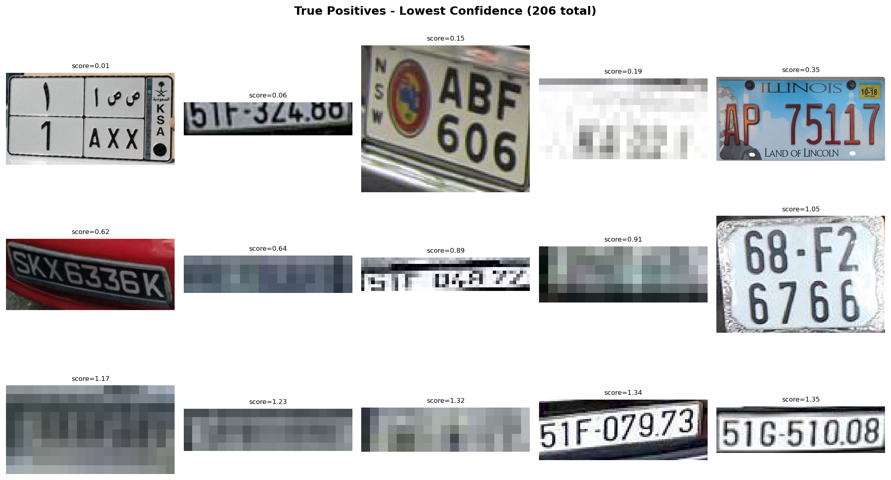

# Qualitative Analysis Report: SVM (Linear)

> Dataset: `data/raw/test/images`
> Model: `models/svm_plate_linear.joblib`
> Images analyzed: 200

## Summary

The SVM is evaluated on pre-cropped patches, each plate region and several
random background regions are extracted, passed through HOG, and classified.
This measures the quality of the HOG + SVM combination in isolation,
independent of the sliding window localization step.

| Metric | Value |
| --- | --- |
| Total crops | 620 |
| Positive crops (plates) | 222 |
| Negative crops (background) | 398 |
| True Positives | 206 |
| False Negatives | 16 |
| False Positives | 2 |
| True Negatives | 396 |
| Precision | 0.9904 |
| Recall | 0.9279 |
| F1 | 0.9581 |

## Visualizations

### True Positives (lowest confidence)
These are plates the model correctly identified, but with the lowest scores.
They show the boundary of what the model considers a plate, the cases
where the HOG gradient pattern was just barely 'plate-like' enough to pass.

### False Negatives (missed plates)
These are actual plates that the model classified as background.
Look for patterns: small plates, blur, occlusion, unusual angles.
Some may be too degraded to classify even by human eye, those
represent a data quality issue rather than a model failure.

### False Positives (background called plate)
These are background patches the model mistakenly called plates.
Look for patterns: rectangular shapes, text-like textures, high contrast
edges, anything that produces a plate-like HOG gradient signature.

