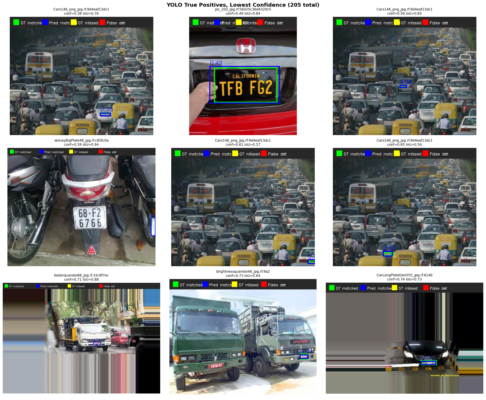

# YOLO Qualitative Analysis Report

> Dataset: `data/raw/test/images`
> Model: `models/yolo_plate.pt`
> Images analyzed: 200
> IoU threshold: 0.5
> Confidence threshold: 0.25

## Summary

Unlike the SVM qualitative analysis which evaluates on cropped patches,
this analysis runs full-image detection YOLO must both locate and classify
the plate in a single pass. Predictions are matched to ground truth using IoU.

| Metric | Value |
| --- | --- |
| Images analyzed | 200 |
| True Positives | 205 |
| False Positives | 6 |
| False Negatives | 17 |
| Precision | 0.9716 |
| Recall | 0.9234 |
| F1 | 0.9469 |

## Visualizations

In all images below: **green boxes** = ground truth, **red boxes** = YOLO predictions.

### True Positives (lowest confidence)
These are plates YOLO detected correctly, but with the lowest confidence scores.
They represent the edge of what the model considers a plate the cases where
it was least sure but still got it right. Look for patterns: distant plates,
unusual angles, or partially visible plates that made the model hesitate.

### False Negatives (missed plates)
These are actual plates that YOLO failed to detect entirely.
Compare these with the SVM false negatives to see whether both models
struggle with the same cases (e.g. tiny plates, heavy blur) or whether
YOLO handles some failure modes that the classical pipeline cannot.

### False Positives (spurious detections)
These are detections that don't match any ground truth plate.
Look for what confused the model: rectangular signs, text on buildings,
reflective surfaces, or other plate-like patterns in the scene.

