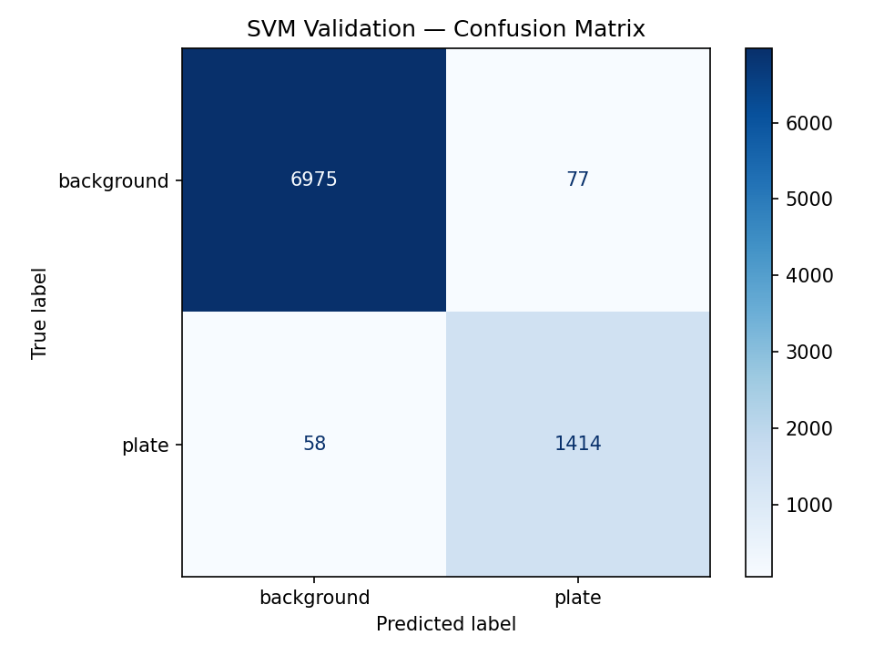

# Classical vs Deep Learning for License Plate Detection

## A Comparison of HOG + SVM and YOLOv8n for Object Detection

---

## 1. Introduction

Object detection is one of the core tasks in computer vision. Given an image, the goal is to locate objects of interest and output their positions as bounding boxes. Over the past decade, deep learning methods — particularly the YOLO family of detectors — have become the dominant approach for this task. However, classical methods based on hand-crafted features and traditional machine learning classifiers were the standard for many years before that, and in some settings they remain competitive.

This project compares a **classical detection pipeline** (HOG feature extraction + SVM classification) against a **modern deep learning detector** (YOLOv8n) on the task of **license plate detection**. The goal is not to prove that deep learning is better — that outcome is largely expected — but rather to investigate *how far* a classical approach can go, and to identify the specific conditions under which it succeeds or fails compared to a learned detector.

License plate detection was chosen as the domain because it sits in a useful middle ground: plates have strong edges, rectangular structure, and fairly consistent visual properties, which gives classical methods a real chance. At the same time, real-world images introduce challenges like motion blur, viewpoint variation, small targets, and cluttered backgrounds, where deep learning is expected to have an advantage.

**Important note:** This project focuses only on detection (localizing the plate in the image), not on recognition or OCR (reading the plate text).

---

## 2. Dataset

We use the **License Plate Detection Dataset** from Kaggle, which contains **10,125 annotated images** of vehicles with bounding box labels for license plates.

The dataset is pre-split into three subsets:

| Split | Purpose |
| --- | --- |
| Train | Model training (~7,057 images) |
| Valid | Hyperparameter tuning and validation |
| Test | Final evaluation and comparison |

Each image is accompanied by a YOLO-format label file containing one or more bounding box annotations. Each line in a label file has the format:

```
class  x_center  y_center  width  height
```

where all coordinates are normalized to [0, 1] relative to image dimensions. The class index is always `0` (license plate).

The images vary in resolution and capture conditions. They include a mix of front and rear vehicle views, different lighting conditions, and various plate sizes relative to the image.

Source: [Kaggle — License Plate Detection Dataset (10,125 Images)](https://www.kaggle.com/datasets/barkataliarbab/license-plate-detection-dataset-10125-images)

---

## 3. Methods

### 3.1 Classical Pipeline: HOG + SVM

The classical approach follows a standard sliding-window detection pipeline. It consists of two main components:

**HOG (Histogram of Oriented Gradients)** is responsible for feature extraction. Given an image patch, HOG computes a numerical descriptor based on the distribution of local edge directions. The patch is divided into cells, and for each cell a histogram of gradient orientations is computed. These histograms are then normalized across overlapping blocks to produce a single feature vector.

We use the following HOG parameters:

| Parameter | Value |
| --- | --- |
| Target patch size | 64 × 128 pixels |
| Orientations | 9 |
| Pixels per cell | 8 × 8 |
| Cells per block | 2 × 2 |
| Block normalization | L2-Hys |
| Output feature dimension | 3,780 |

**SVM (Support Vector Machine)** is the classifier. It receives a 3,780-dimensional HOG feature vector and outputs a binary decision: plate or background. We use a linear kernel SVM with feature scaling (StandardScaler) and balanced class weights.

#### Training data preparation

The SVM needs both positive and negative training examples. For each training image:

- **Positive samples**: the license plate region is cropped using the ground-truth bounding box, then passed through HOG to produce a feature vector (label = 1).
- **Negative samples**: 5 random background patches are cropped from the same image, ensuring they do not significantly overlap with the plate region (IoU < 0.1). Each is passed through HOG to produce a feature vector (label = 0).

This produced a training set of **42,617 samples** (7,357 positive, 35,260 negative), which was split 80/20 into train and validation sets.

#### Hyperparameter tuning

We performed a grid search over the regularization parameter C ∈ {0.1, 1, 10} with a linear kernel, using 3-fold cross-validation optimizing for F1 score. All three values produced nearly identical results, and the best configuration was **C = 0.1, linear kernel** with a cross-validation F1 of **0.9556**.

#### Detection pipeline

At inference time, the trained SVM is used inside a sliding-window detector:

1. A set of candidate windows is generated at multiple scales across the image.
2. Each window is cropped, resized to 64 × 128 pixels, and passed through HOG.
3. The SVM scores each resulting feature vector.
4. Windows with scores above a threshold are kept as candidate detections.
5. Non-maximum suppression (NMS) merges overlapping detections.

The output is a set of bounding boxes with confidence scores.

### 3.2 Deep Learning Pipeline: YOLOv8n

*[To be completed after YOLO training]*

YOLOv8n (nano) is the smallest variant of the YOLOv8 architecture. Unlike the classical pipeline, YOLO performs detection in a single forward pass through a neural network — it learns both feature extraction and bounding box prediction end-to-end during training.

We fine-tune a pretrained YOLOv8n model on our license plate dataset using the ultralytics library.

---

## 4. Results

### 4.1 Classical Pipeline — Crop Classification

Before evaluating the full detection pipeline, we first assess how well the SVM classifies individual image crops (plate vs background). This measures the quality of the HOG + SVM combination in isolation.

| Metric | Score |
| --- | --- |
| Precision | 0.9484 |
| Recall | 0.9606 |
| F1 Score | 0.9544 |

The confusion matrix on the validation set (8,524 samples):

| | Predicted Background | Predicted Plate |
| --- | --- | --- |
| **Actual Background** | 6,975 (TN) | 77 (FP) |
| **Actual Plate** | 58 (FN) | 1,414 (TP) |



These results show that the SVM achieves strong crop-level accuracy. It correctly identifies 96% of plate crops and has a low false positive rate (about 1% of background crops are misclassified as plates).

However, it is important to note that these numbers reflect **classification of pre-cropped patches**, not full-image detection. In a real detection scenario, the sliding window generates thousands of candidate patches per image, and even a small false positive rate can produce many spurious detections.

### 4.2 Classical Pipeline — Full-Image Detection

*[To be completed after running the sliding window detector on the test set]*

### 4.3 Deep Learning Pipeline — YOLOv8n

*[To be completed after YOLO training and evaluation]*

### 4.4 Comparison

*[To be completed — both pipelines evaluated on the same test set with the same IoU thresholds]*

---

## 5. Failure Analysis

*[To be completed after qualitative analysis]*

This section will examine specific examples where each method succeeds or fails, categorized by:

- **Plate size** — small vs large plates relative to the image
- **Viewing angle** — frontal vs angled views
- **Image quality** — clear vs blurry or low-light images
- **Background complexity** — simple vs cluttered scenes
- **Occlusion** — fully visible vs partially occluded plates

The goal is to identify systematic patterns in failure modes rather than cherry-picking individual examples.

---

## 6. Discussion

*[To be completed after all results are in]*

Expected topics to cover:

- The classical pipeline achieves strong crop-level classification, but how does this translate to full-image detection performance?
- Where does the gap between HOG + SVM and YOLO become most apparent?
- What properties of license plates make them amenable to classical detection?
- Under what conditions would a classical approach be preferable (computational constraints, limited training data, interpretability)?

---

## 7. Conclusion

*[To be completed]*

---

## References

- Dalal, N. and Triggs, B. (2005). *Histograms of Oriented Gradients for Human Detection*. CVPR.
- Jocher, G. et al. (2023). *Ultralytics YOLOv8*. https://github.com/ultralytics/ultralytics
- License Plate Detection Dataset. https://www.kaggle.com/datasets/barkataliarbab/license-plate-detection-dataset-10125-images

---

## Appendix

### A. Project Structure

```
project/
├── data/
│   ├── features/          # HOG feature vectors (.npy)
│   └── raw/
│       ├── train/         # Training images + YOLO labels
│       ├── valid/         # Validation images + labels
│       └── test/          # Test images + labels
├── models/
│   └── svm_plate.joblib/  # Trained SVM model file
├── paper/
│   └── report.md/         # Project report and analysis
│
├── src/
│   ├── classical/
│   │   ├── hog_features.py              # HOG feature extraction
│   │   ├── svm_classifier.py            # SVM training and inference
│   │   ├── detector.py                  # Sliding window + NMS
│   │   ├── train_svm.py                 # Training script
│   │   └── training_data_preparation.py # Positive + negative crop sampling
│   ├── deep/              # YOLO training and inference
│   └── evaluation/
│       ├── metrics.py                   # Classification + detection metrics
│       └── qualitative_analysis.py      # Visual analysis of predictions
└── outputs/               # plots, analysis results
```

### B. Software and Libraries

| Library | Version | Purpose |
| --- | --- | --- |
| Python | 3.12+ | Runtime |
| scikit-learn | latest | SVM classifier, grid search, metrics |
| scikit-image | latest | HOG feature extraction |
| OpenCV | latest | Image I/O and preprocessing |
| NumPy | latest | Array operations |
| Matplotlib | latest | Plotting and visualization |
| joblib | latest | Model serialization |
| ultralytics | latest | YOLOv8 training and inference |